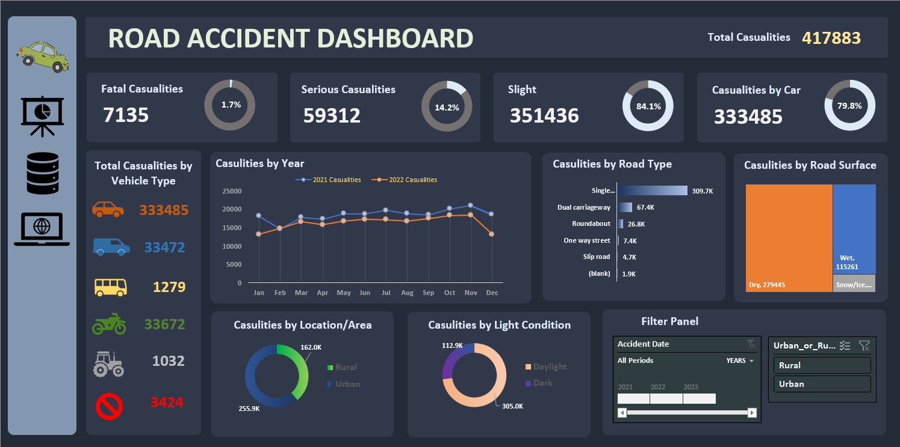

# Excel-Project_Road-Accident-Dashboard
Road accidents present a substantial threat to public safety, and the analysis of accident data plays a crucial role in identifying patterns, areas at high risk, and factors that contribute to accidents. 
Through this project, we will gain expertise in utilizing the robust capabilities of Excel to convert unprocessed accident data into an engaging and dynamic dashboard with visually appealing representations.

This project consist a few steps:

